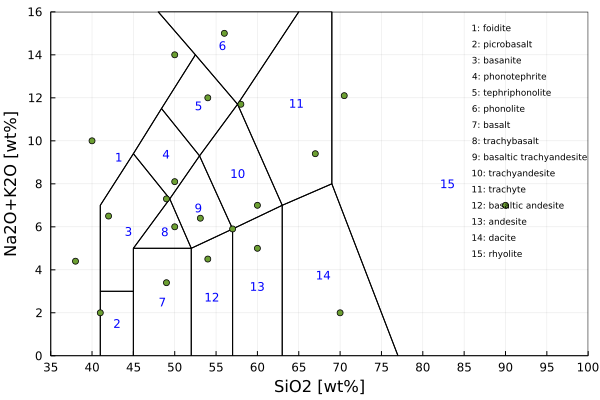

# TAS rock classification

# Methods
When doing coupled petrological-geodynamic modelling, the evolution of the composition of the magma is more easily understood when a rock type is given. This routine is an implementation of the TAS diagram (Total Alkali (TA) vs Silica (S)) from Le Maitre et al., 2002.

```@docs
GeoParams.TASclassificationData
```

# Computational routine
There is one routine with which you can retrieve the index of the TAS rock-type. The routine receives as an input a compositional vector [SiO2,Na2O+K2O] in wt% and sends back an index [1-15].


```@docs
GeoParams.computeTASclassification
```
Using the index of the rock-type you can get the name of the corresponding volcanic rock using the following routine.


```@docs
GeoParams.retrieveTASrockType
```

We also provide a plotting routine, provided the GLMakie.jl package is loaded, which produces figures such as:

